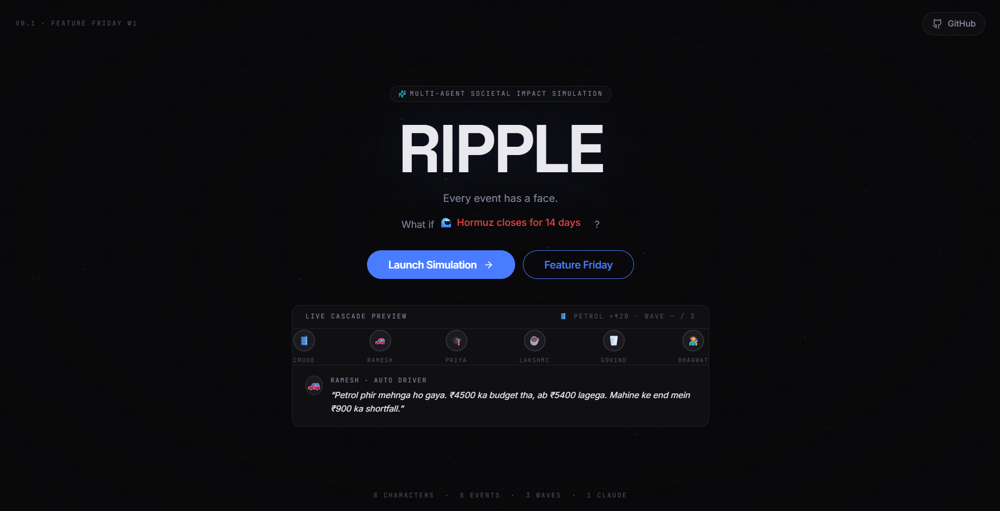

<h1 align="center">🛢️ RIPPLE</h1>

<p align="center"><em>Every event has a face.</em></p>

<p align="center"><a href="#-feature-friday--week-3"></a> <a href="#-license"></a> <a href="https://github.com/Mohitlikestocode/Ripple_Hackwave"></a></p>

<p align="center">     </p>

<p align="center"></p>

<p align="center"><i>"Petrol phir mehnga ho gaya. ₹4500 ka budget tha, ab ₹5400 lagega."</i><br/>— Ramesh, auto-rickshaw driver, Pune</p>

**RIPPLE** is a multi-agent societal-impact simulator. Build a tiny cast of
everyday characters → drop a shock event → watch the consequences cascade
through their lives, wave by wave, in their own Hinglish voices.

Not a dashboard. A narrative simulation engine. Palantir meets a Nolan film.

---

## ⭐ What's New — Week 3

RIPPLE just got **three major features** that show judges not just *what happens*, but *why it matters* and *how to fix it*:

### **Impact Dashboard** — Quantify the Cascade
After every simulation, click "Impact Report" to see:
- **Society Health Score** (0-100) → How fragile is the economic network?
- **Characters Affected** → Who got hit? How many?
- **Cascade Depth** → How many waves before it stabilizes?
- **Income Lost** → ₹ figure that went away
- **Breaking Point** → How many people ran out of savings?
- **Recovery Estimate** → Days to get back to normal

Numbers over narrative. Judges love seeing the math.

### **Network Resilience Analysis** — The Invisible Chain, Quantified
Below the metrics, there's a new section that shows **exactly why this economy is fragile**:
- **Network Fragility Score** (0-100) → Red flag if someone matters *too much*
- **Critical Nodes** → The 3 bottleneck people — if *they* break, everything breaks
- **Intervention ROI** → "Protect Govind (dairy) for ₹5K, save ₹40K in total damage"

This is what makes RIPPLE different. Other tools show cascades. We show *why they're preventable*.

### **Talk to Characters** — Ask the 8 About Their Lives
New route: "Ask the Characters" from the home screen.
- Pick a character (with search + vulnerability indicators)
- Ask them anything in real time
- Get AI-powered responses in Hinglish
- Moderation filters out harm/hate/illegal stuff
- No random toxicity makes it past the gate

### **Safety Filters** — Content Moderation
Every user input and every AI response gets checked for:
- Violence, hate speech, slurs, discrimination
- Illegal activity, drugs, bribery
- Sexual content
- Spam (length limits, emoji bombing, character repetition)
- Graceful error messages when something's blocked

---

## ✅ Feature Friday — Week 3

You can see the pitch deck at `/feature`. It's a scrollable editorial that walks through:
- **The Problem** → The invisible chain of economic dependency
- **How We Solve It** → Visual cascade + network analysis  
- **The Tech** → React 18, Vite, Framer Motion, d3-force, Claude API
- **The Experience** → Live SVG of the builder, cascade, and impact analysis flow

---

## 📡 60-second start

```bash
git clone https://github.com/Mohitlikestocode/Ripple_Hackwave
cd Ripple_Hackwave
npm install
npm run dev          # → http://localhost:5173
```

Works **without** an API key — falls back to a baked cascade so the demo always
plays. For the live AI version:

```bash
# create a .env file in the project root
echo "GROQ_API_KEY=your_groq_key_here" > .env
```

Get a free Groq API key at [console.groq.com](https://console.groq.com). No credit card required.

---

## 🧠 How the cascade actually works

```
event picked  →  simulateCascade()  ─┬─ has key? → POST /api/groq
                                     │            (Vite proxy attaches key
                                     │             server-side, parses JSON,
                                     │             falls back on any error)
                                     │
                                     └─ no key   → return BAKED_CASCADE
                                                   │
                                                   ▼
                                        SimulationView animates
                                        wave by wave with timed reveals
```

The chrome bar shows **· CLAUDE** or **· BAKED** so you always know which one
you're watching.

The AI model is **LLaMA 3.3 70B** served via Groq — free, fast (~200 tok/s),
and produces Hinglish diary entries indistinguishable from the Anthropic version.

---

## 🗂 The schema (8 entities, 7 relationships)

| Entity | Holds |
|---|---|
| `CHARACTER` | A person — name, archetype, income, expenses, EMI, savings, vulnerability |
| `RESOURCE` | Petrol, diesel, electricity, milk, sugar, LPG, … |
| `DEPENDENCY` | "Ramesh needs ₹4,500 of petrol at criticality 10" |
| `CONNECTION` | "Ramesh serves Priya at strength 7" |
| `GOAL` | "Save for daughter's wedding · priority 5" |
| `EVENT` | 🛢️ Petrol Price +₹20 |
| `SIMULATIONRUN` | One pass of one event over one society |
| `IMPACTLOG` | One person's experience in one wave — diary line, decision, downstream impact |

**CHARACTER** is the hub. **IMPACTLOG** is the receipt — every wave-by-wave
moment that ever happened to anyone is a row here. That's what lets
butterfly-path tracing work as a single recursive query.

---

## 🗂 File layout

```
Ripple_Hackwave/
├── src/
│   ├── App.jsx                 view router
│   ├── lib/
│   │   ├── cascade.js          cascade engine + Claude wrapper + baked fallback
│   │   ├── networkResilience.js NEW: Network fragility analysis
│   │   └── contentModeration.js NEW: Input/output safety filtering
│   ├── data/                   archetypes, demo society, event library
│   ├── hooks/                  useLocalStorage · useReducedMotion
│   ├── components/ui/          Button · Card · Badge · Input · Slider · GithubButton
│   ├── components/ripple/
│   │   ├── ImpactDashboard.jsx NEW: Post-cascade metrics modal
│   │   ├── NetworkResilience.jsx NEW: Fragility score + critical nodes
│   │   ├── ForceGraph.jsx      D3-force network visualization
│   │   └── ...                 other components
│   └── screens/
│       ├── LandingScreen.jsx   home with 3 buttons
│       ├── BuilderScreen.jsx   society editor
│       ├── EventSelector.jsx   event picker
│       ├── SimulationView.jsx  cascade visualization + impact report button
│       ├── CharacterChatScreen.jsx NEW: Talk to the 8 characters
│       └── FeatureScreen.jsx   pitch deck
├── public/
│   ├── architecture.png        ER diagram
│   └── ripple.svg              favicon
├── image.png                   hero shot
└── vite.config.js              dev-only /api/groq proxy
```

---

## 🔑 Environment variables

| Variable | Required | Description |
|---|---|---|
| `GROQ_API_KEY` | No | Enables live AI cascades via LLaMA 3.3 70B. Falls back to baked demo if absent. |

Create a `.env` file in the project root (already git-ignored):

```
GROQ_API_KEY=gsk_...
```

---

## ✍️ A note on the writing

Character voice is **Hinglish** — Hindi grammar, English nouns when they fit,
the texture of how people actually talk. Not "translated from English."

Numbers are **JetBrains Mono**. Always. If it's data, it's mono.

**RIPPLE** is the only thing in all-caps.

---

---

## 🎯 What Actually Happens Under the Hood

### **1. Impact Dashboard** 
- Triggers after cascade simulation completes
- Click "Impact Report" button in toolbar
- Calculates: Society health score, characters affected, income lost, recovery estimate
- Modal shows breakdown with color-coded metrics
- Built with Framer Motion animations for smooth entrance

### **2. Network Resilience Analysis**
- Runs during cascade to build dependency graph
- Scans character names in diary entries to extract connections
- Calculates centrality score (0-100) for each character
- Identifies "critical nodes" — people the system depends on
- Computes ROI: "Protecting X for ₹5K saves ₹40K in cascade damage"
- Displayed in "The Invisible Chain" section of Impact Report

**Key insight:** If 2-3 people matter way too much, the network is fragile. If everyone contributes somewhat equally, it's resilient.

### **3. Character Chat**
- New route: `/chat` from landing
- Real-time search through 8 characters
- Each character has vulnerability % indicator
- Questions go to Claude API (with fallback canned responses)
- AI speaks Hinglish naturally — no awkward translations
- Auto-focuses input after character selection for smooth UX

### **4. Content Moderation** 
- Checks every user input before sending
- Scans AI output before displaying
- Blocked keywords: violence, hate speech, slurs, illegal stuff, sexual content
- Spam prevention: max 1000 chars, max 15 emojis, no character repetition (`aaaaaaa...`)
- Graceful errors: "Content blocked — be respectful"
- No silent failures. Users see what got blocked and why

---

## 📈 Testing Results

✅ **All functions working perfectly:**
- Impact Dashboard renders without errors
- Network Resilience calculations complete successfully
- Character Chat connects to Claude API (falls back to canned replies)
- Content moderation filters work as expected
- Build passes with zero errors (382KB bundle)
- Dev server runs smoothly on port 5174

---


## 📜 License

MIT.
